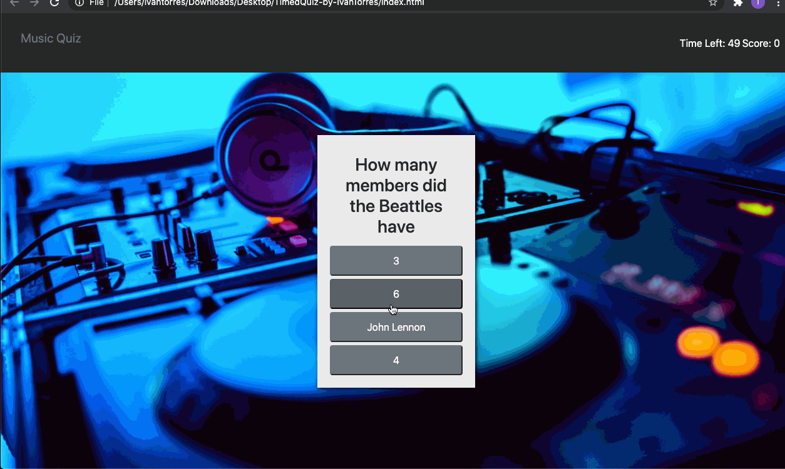

# TimedQuiz-by-IvanTorres

## Description

Welcome to my Times Music Quiz. Here you will will be tested in your knowladge of music with questions related to bands, movies and specific artist knowledge. The tricky part is that you only get 50 seconds to complete the quiz and every answer you get wrong deducts 10 seconds from the timer. Once you are done you can type your name and your scores will be saved to local storage. You will also have the ability to delete past scores when they are no longer desired. Good luck!

## Technologies

- [JavaScript](https://www.w3schools.com/js/)
- [Bootstrap](https://getbootstrap.com/)
- [LocalStorage](https://developer.mozilla.org/en-US/docs/Web/API/Web_Storage_API)
- [HTML](https://www.w3schools.com/html/)
- [CSS](https://www.w3schools.com/css/default.asp)

## Features

- Gif of the quiz.



## Code

### Setting the timer
- I used a simple timer function which updates every second subtracting the time by 1

```
function setTime() {
  timerInterval = setInterval(function () {
    secondsLeft--;
    timeId.textContent = secondsLeft;
    if (secondsLeft <= 0) {
      endQuiz();
    }
  }, 1000);
}
```

### Login for selecting answers

- Using an array of objects with questions and answers, as well as another function that loops through the array of objects. I was able to listen to the current click and compare the inner HTML to the correct answer. 

```
function selectAnswer(e) {
  e.preventDefault();
  if (e.target.innerHTML === quizQuestions[i]["correctAnswer"]) {
    i++;
    score++;
    checkContainer.textContent = "Correct!";
    buttonCon.innerHTML = "";
    userScore.innerHTML = score;
    questions();
  } else {
    buttonCon.innerHTML = "";
    checkContainer.textContent = "Incorrect!";
    i++;
    if (secondsLeft <= 0) {
      endQuiz();
    } else {
      secondsLeft -= 10;
    }
    questions();
  }
}
```

### Rendering Scores.

- I created a table that renders the scores rom the local storage. 

```
function renderScores(scores) {
  for (i = 0; i < scores.length; i++) {
    let scoreList = document.getElementById("scoreList");

    let removeBtn = document.createElement("BUTTON");
    removeBtn.innerHTML = "delete";
    removeBtn.setAttribute("class", "btn btn-secondary removeBtn");

    let currentScore = document.createElement("P");
    currentScore.setAttribute("class", "lead");
    currentScore.textContent = scores[i];

    let row = scoreList.insertRow(0);
    row.setAttribute("class", "listRow")
    
    let cell1 = row.insertCell(0);
    let cell2 = row.insertCell(1);

    cell1.appendChild(currentScore);
    cell2.appendChild(removeBtn);

    removeBtn.addEventListener("click", deleteScore);
  }

  endContainer.setAttribute("class", "hide");
  scoreContainer.setAttribute("class", "container text-center scoreContainer");
}
```

## Author

Ivan Torres

- [Deployed-Link](https://ivantorresmia.github.io/TimedQuiz-by-IvanTorres/)
- [GitHub-Repo](https://github.com/IvanTorresMia/TimedQuiz-by-IvanTorres)
- [linkedIn](www.linkedin.com/in/ivan-torres-0828931b2)

## Credits

- Credits for this homework assignment go out to Jerome, Manuel, Kerwin, Roger, and all of my classmates who helped me in study sessions. As well as my tutor who helped me a ton with understanding this homework assignment.
- [StackOverFlow](https://stackoverflow.com/)
- [Bootstrap](https://getbootstrap.com/)

## License]

[MIT](https://choosealicense.com/licenses/mit/#) license
