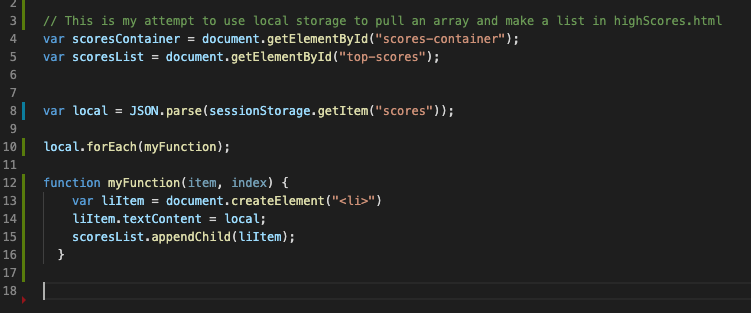

# TimedQuiz-by-IvanTorres

## Description 
Welcome to my music quiz. In here you will find how much you know about music and trust me every questions is very well thought out so let's see how much of an expert you are. You are presented with start button then once you click you are presented with 10 questions which you will press buttons for and a timer which will start at 75 seconds. So here's the tricky part, anytime you get one of my very hard questions wrong your timer will deduct time and you are now running out of time to finish this quiz. Once you are done you will be presented with a form where you can input your initials and it should keep track of your scores, then display them in that same container. 

## Technologies
* [JavaScript](https://www.w3schools.com/js/)
* [Bootstrap](https://getbootstrap.com/)

## Features
* Gif of my Website. 


* This project was definetely challenging but with the guidence of my tutor and the help from some fellow students I was able to build this and make it work, here are some code snippets I made. 


* This code listens to the start button and once it is clicked it hides all the containers and shows the questions container. 

```
 tartBtn.addEventListener("click", function () {
  startContainer.setAttribute("class", "hide");
  endContainer.setAttribute("class", "hide");
  questionsContainer.setAttribute("class", "none");

  setTime();
  startQuiz();
});

  ```

* This code is an example of what happens when you press one of the answer buttons. It increments i so therefore you get a new set of questions for the next round. 

```
  if (i == quizQuestions.length) {
    endQuiz();
  }
  questionsDisplay.textContent = quizQuestions[i]["question"];
  button1.textContent = quizQuestions[i].choices[0];
  button2.textContent = quizQuestions[i].choices[1];
  button3.textContent = quizQuestions[i].choices[2];
  button4.textContent = quizQuestions[i].choices[3];
}

button1.addEventListener("click", function (event) {
  if (event.target.innerHTML === quizQuestions[i]["correctAnswer"]) {
    i++;
    score++;
    checkContainer.textContent = "Correct!"
    startQuiz();
  } else {
    checkContainer.textContent = "Incorrect!"
    i++;
    if (secondsLeft === 0) {
        endQuiz();
    } else {
        secondsLeft = secondsLeft - 10;
    }
    startQuiz();
  }
});
  ```


* This function ends the quiz hidding all of the containers and showing the last one for your initials. You can call this function when ever you want the game to end. 

```
function endQuiz() {
  startContainer.setAttribute("class", "hide");
  endContainer.setAttribute("class", "none");
  questionsContainer.setAttribute("class", "hide");
  i = 0;
  clearInterval(timerInterval);
  timeId.textContent = 0;
};
```

Local storage attempt

* This Code was an attempt to use local storage to display the scores in another, unfortunately I began to run out of time and went another way but decided to include this here anyways because I think I got close.

* This is the code that when you click the submit button you send a new array into the local storage by using JSON.stringify


* This Code was in another script.js file dedicated to another html file which would be used to display the scores pulling the array and using JSON.parse and using forEach to make them into a list. 



* This is what would have been the container in the Scores.html file in which the scores would be displayed. 


## Author
Ivan Torres
* [Deployed-Link](https://ivantorresmia.github.io/TimedQuiz-by-IvanTorres/)
* [GitHub-Repo](https://github.com/IvanTorresMia/TimedQuiz-by-IvanTorres)
* [linkedIn](www.linkedin.com/in/ivan-torres-0828931b2)

## Credits
* Credits for this homework assignment go out to Jerome, Manuel, Kerwin, Roger, and all of my classmates who helped me in study sessions. As well as my tutor who helped me a ton with understanding this homework assignment. 
* [StackOverFlow](https://stackoverflow.com/)
* [Bootstrap](https://getbootstrap.com/)


## License]
[MIT](https://choosealicense.com/licenses/mit/#) license 